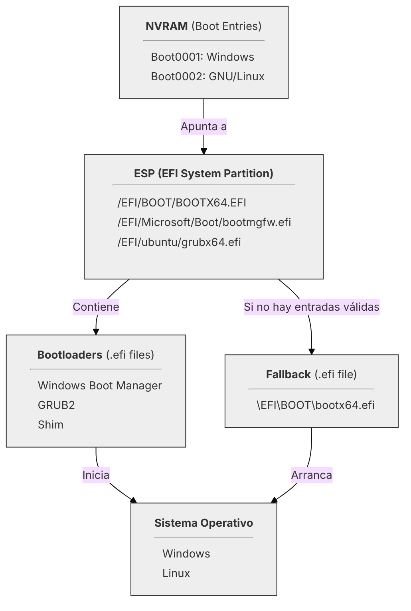
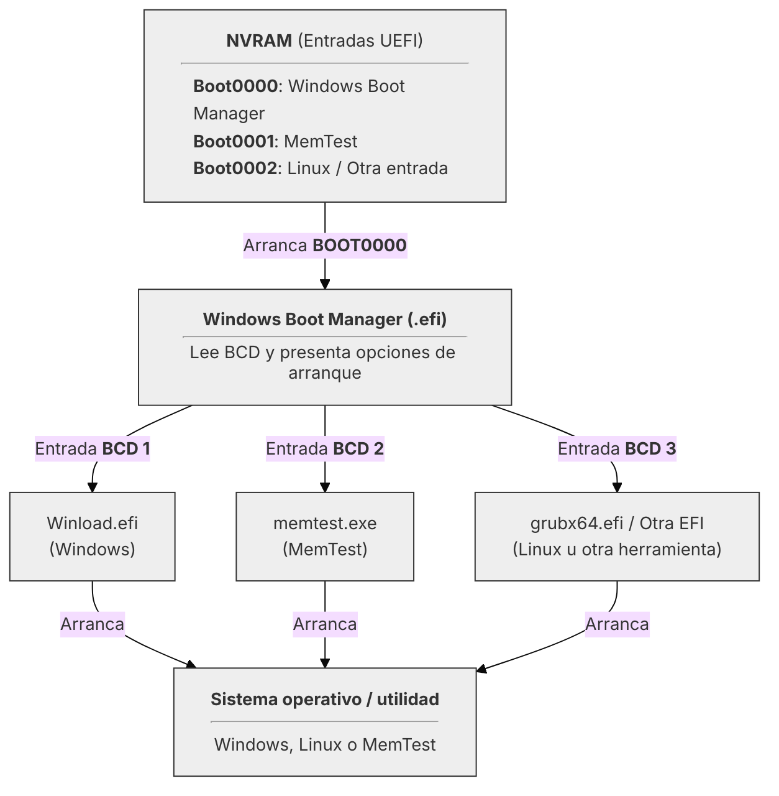

# Entendiendo UEFI

---

## 3. Gestión del registro de arranque UEFI (NVRAM)

Como hemos visto anteriormente, la [**NVRAM**](99-glosario.md#nvram-non-volatile-random-access-memory) es una memoria,
normalmente integrada en la placa base y de naturaleza no volátil, que almacena las **entradas de arranque** (_boot
entries_).

Cuando se instala un sistema operativo, este crea una entrada en la NVRAM que le indica al 
[**firmware UEFI**](99-glosario.md#firmware-uefi) lo siguiente:

- **Ruta** del [**cargador de arranque**](99-glosario.md#bootloader-cargador-de-arranque) (`.efi` dentro de la 
[**ESP**](99-glosario.md#esp-efi-system-partition)).
- **Nombre de la entrada** que aparecerá en el menú de arranque.

La **gestión de la NVRAM** se centra en manipular esa lista de entradas para poder _añadir_, _eliminar_ y _reordenar_ estos
registros permitiendo al usuario controlar el arranque de sus sistemas sin necesidad de reinstalarlos.

Este capítulo se enfoca en el uso de las herramientas más comunes para este fin, tanto dentro del mundo Windows como del
mundo GNU/Linux.

<div style="text-align: center">


</div>

---

### 3.1 Herramientas de gestión en sistemas modernos

La mayoría de los **firmware UEFI** permiten gestionar de una manera limitada las entradas de la NVRAM desde el propio 
[setup de la BIOS]("Término heredado: se refiere a la interfaz de configuración del firmware, que en realidad es UEFI."),
por ejemplo, para cambiar el orden de arranque o deshabilitar alguna entrada, y los sistemas 
operativos modernos tienen herramientas en línea de comandos que permiten un control mucho más exhaustivo, preciso y
flexible sobre las rutas y nombres de entradas, lo cual es esencial para una configuración precisa y un diagnóstico
efectivo.

Las dos herramientas que abordaremos en detalle son:

1. **`bcdedit`** (en Windows): Herramienta originalmente concebida para la configuración de arranque de los sistemas 
Windows que hubiera en una máquina, pero extendida para gestionar la NVRAM.
2. **`efibootmgr`** (en GNU/Linux): simple y potente herramienta de código abierto que permite la interacción con las
entradas almacenadas en la NVRAM.

---

#### 3.1.1 `bcdedit` en Windows

`bcdedit` es una herramienta de línea de comandos incluida en Windows que permite gestionar el 
[**BCD**](99-glosario.md#bcd-boot-configuration-data) (_Boot Configuration Data_), que es la base de datos que almacena
la configuración de arranque del sistema operativo Windows, así como las entradas registradas en la **NVRAM**.

Ya que `bcdedit` trabaja sobre el **BCD** y sobre la **NVRAM**, conviene aclarar la diferencia entre ambas capas:

- **BCD** es una _base de datos_ (normalmente el archivo `\EFI\Microsoft\Boot\BCD`) que contienen la configuración 
de arranque específica de Windows. Incluye información sobre los sistemas operativos instalados, herramientas que
necesitan de arranque, así como sus opciones de 
arranque y otros parámetros relacionados con el proceso de inicio. Es decir, una vez el `.efi` de Windows es cargado por 
el firmware, este `.efi` lee el BCD para saber qué hacer a continuación y el BCD puede dar múltiples opciones de arranque 
(por ejemplo, diferentes versiones de Windows u otros sistemas operativos).

Por simplificar, podría decirse que la **BCD** es una capa lógica gestionada por Windows que hace lo mismo (muy 
parecido) a lo que hace la **NVRAM**.

Así, Windows utiliza `bcdedit` para sincronizar y mantener ambas capas:

 - Las modificaciones en el **BCD** se pueden reflejar en las entradas de la **NVRAM**.
 - El contenido de la NVRAM puede contener entradas diferentes a las del **BCD**.

<div style="text-align: center">



</div>

??? failure "Windows Boot Manager **NO** arranca cualquier `.efi`"
    A diferencia de **firmware UEFI**, el **Windows Boot Manager** no está diseñado para arrancar cualquier
    archivo `.efi` arbitrario. Solo puede iniciar los cargadores de arranque específicos de Windows (como `winload.efi`)
    y algunas herramientas de diagnóstico proporcionadas por Microsoft (como `memtest.exe`).
    Lo expuesto arriba es el modelo teórico de cómo funciona `bcdedit` y el **BCD** en relación con la **NVRAM**, pero en 
    la práctica, en el **BCD** solo deben registrarse entradas relacionadas con Windows y sus herramientas oficiales.

`bcdedit` debe ejecutarse con **privilegios de administrador** desde una ventana de _PowerShell_ o _Símbolo del sistema_.

Su forma de uso general es:

```powershell
bcdedit /command [options]
```

Donde `/command` es la acción que se desea realizar (como `/enum`, `/set`, `/delete`, etc.) y `[options]` son los
parámetros específicos para esa acción. (En la sección 3.2 se detallan algunas de estas operaciones).

---

#### 3.1.2 `efibootmgr` en GNU/Linux

`efibootmgr` es una herramienta de línea de comandos que permite gestionar las entradas de arranque
almacenadas directamente en la **NVRAM** del **firmware UEFI**. Es la utilidad nativa y estándar para este fin en la 
mayoría de las distribuciones **GNU/Linux**.

Debe ejecutarse con **privilegios de superusuario** (usando `sudo` o como `root`) desde una terminal.

Su forma de uso general es:

```bash
efibootmgr [options]
```

A diferencia de `bcdedit` (que trabaja sobre el BCD), `efibootmgr` interactúa de forma directa y minimalista con la
capa de *firmware* para consultar y manipular los registros de arranque.

---

### 3.2 Operaciones fundamentales en la NVRAM

A continuación, se describen algunas de las operaciones más comunes que se pueden realizar con `bcdedit` y `efibootmgr`.

??? note "Diferencias clave entre Powershell y CMD para entender los ejemplos"
    Cuando se ejecuta un comando en Windows es importante tener claro que **PowerShell** y el **Símbolo del sistema 
    (CMD)** tienen diferente manera de interpretar los comandos y sus parámetros. 

    **{++CMD++}**: Espera el nombre del comando seguido de una cadena con los parámetros que le hagan falta. Así, **CMD** 
    pasa esta cadena tal cual al programa que se ejecuta y este se encarga de parsearla.

    **{++Powershell++}**: Interpreta los argumentos de manera independiente y se los va pasando al programa, por ejemplo, 
    los corchetes `[]` y llaves `{}` tienen un significado especial y deben escaparse si se quieren
    usar literalmente.

    La sintaxis que se emplea en este documento está adaptada para **Powershell** de manera que **se añaden comillas 
    dobles** `"` alrededor de los parámetros que contienen caracteres especiales. Estas comillas no son necesarias en
    **CMD**.

#### 3.2.1 Visualizar las entradas de arranque existentes

Se trata de mostrar las **entradas de arranque almacenadas**, incluyendo las _rutas a los cargadores de
arranque_ y _sus identificadores únicos_ [(**GUID**)](99-glosario.md#gpt-guid-partition-table).

- **Con `bcdedit` (Windows):**

De manera genérica se ejecuta:

```powershell
bcdedit /enum [<type>] [/v]
```
Por ejemplo, para listar las entradas de arranque de la NVRAM, se usaría:

```powershell
bcdedit /enum firmware
```

??? note "Explicación de los parámetros"
    Con `/enum` se listan las entradas de arranque tanto las internas de Window (BCD) como las externas (NVRAM).
    
    `<type>` filtra el tipo de entradas a mostrar. Algunas de las opciones disponibles son:
    
    - `all`: Muestra todas las entradas (por defecto).
      - `firmware`: Muestra las entradas de arranque UEFI almacenadas en la NVRAM.
      - `osloader`: Muestra las entradas relacionadas con los cargadores de arranque del sistema operativo.
      - `bootmgr`: Muestra la configuración del gestor de arranque de Windows.
    
    Y la opción `/v` (verbose) proporciona información detallada sobre cada entrada.

??? note "Ejemplo de salida de `bcdedit /enum firmware`"
    ```text
    Administrador de arranque de firmware
    -----------------------------------
    Identificador           {fwbootmgr}
    displayorder            {5f6fbbbe-9a03-11f0-9b9e-806e6f6e6963}      <-- GUIDs de las entradas
                            {b0a48ba0-8ef4-11f0-9b9b-806e6f6e6963}          Están en el orden de 
                            {5f6fbbbd-9a03-11f0-9b9e-806e6f6e6963}          arranque.
                            {fe56e23a-9a20-11f0-9bb2-806e6f6e6963}
                            {bootmgr}
                            {4bce5028-9a17-11f0-9bae-806e6f6e6963}
                            {b0a48ba1-8ef4-11f0-9b9b-806e6f6e6963}
    timeout                 1
    
    Administrador de arranque de Windows
    ----------------------------------
    Identificador           {bootmgr}
    device                  partition=S:
    path                    \EFI\MICROSOFT\BOOT\BOOTMGFW.EFI
    description             Windows Boot Manager
    locale                  en-us
    inherit                 {globalsettings}
    default                 {current}
    resumeobject            {d8ab5b8f-9a0c-11f0-9ba5-049226d1be46}
    displayorder            {current}
    toolsdisplayorder       {memdiag}
    timeout                 0
    
    Aplicación de firmware (101fffff)
    ---------------------------------
    Identificador           {4bce5028-9a17-11f0-9bae-806e6f6e6963}      <-- GUID de las entrada
    device                  partition=S:                                <-- Partición ESP
    path                    \EFI\Part-01-02\Boot\bootmgfw.efi           <-- Ruta al .efi
    description             Part-01-02                                  <-- Descripción de la
                                                                            entrada como se
    Aplicación de firmware (101fffff)                                       mostraría en el
    ---------------------------------                                       menú de arranque.
    Identificador           {5f6fbbbd-9a03-11f0-9b9e-806e6f6e6963}
    description             UEFI: PXE IP6 Realtek PCIe GBE Family Controller 

    Aplicación de firmware (101fffff)
    ---------------------------------
    Identificador           {5f6fbbbe-9a03-11f0-9b9e-806e6f6e6963}
    device                  partition=S:
    path                    \EFI\DEBIAN\GRUBX64.EFI
    description             debian
    
    Aplicación de firmware (101fffff)
    ---------------------------------
    Identificador           {b0a48ba0-8ef4-11f0-9b9b-806e6f6e6963}
    description             UEFI: PXE IP4 Realtek PCIe GBE Family Controller
    
    Aplicación de firmware (101fffff)
    ---------------------------------
    Identificador           {b0a48ba1-8ef4-11f0-9b9b-806e6f6e6963}
    description             UEFI: PXE IP6 Realtek PCIe GBE Family Controller
    
    Aplicación de firmware (101fffff)
    ---------------------------------
    Identificador           {fe56e23a-9a20-11f0-9bb2-806e6f6e6963}
    description             Hard Drive
    ```

- **Con `efibootmgr` (GNU/Linux):**

  ```bash
  efibootmgr
  ```
Este comando muestra una lista de las entradas de arranque almacenadas en la NVRAM, junto con sus identificadores 
y el orden de arranque. No requiere parámetros adicionales para una visualización básica.

??? note "Ejemplo de salida de `efibootmgr`"
    ```text
    BootCurrent: 0003
    Timeout: 1 seconds
    BootOrder: 0003,0000
    Boot0000* Windows Boot Manager  HD(2,GPT,c4c56de3-50ca-4443-949e-06ce7f1cdbdc,0xfa000,0x32000)
                                    /File(\EFI\Microsoft\Boot\bootmgfw.efi)57000 [...] 00000400
    Boot0003* ubuntu        HD(2,GPT,c4c56de3-50ca-4443-949e-06ce7f1cdbdc,0xfa000,0x32000)
                            /File(\EFI\ubuntu\shimx64.efi)
    ```
---

#### 3.2.2. Modificar el orden de arranque

Cambiar el orden de arranque permite especificar al **firmware UEFI** qué cargador de arranque debe intentar
iniciar primero. Esta operación requiere el **GUID** en el caso de `bcdedit` o el **número de entrada** en el caso de
`efibootmgr`.

- **Con `bcdedit` (Windows):**

`bcdedit` tiene dos maneras de modificar el orden de arranque:

1. Sobreescribir la lista completa de entradas en el **Firmware Boot Manager ({fwbootmgr})**:

  ```powershell
  bcdedit /set "{fwbootmgr}" displayorder "{GUID1}" "{GUID2}" ...
  ```

2. Manipular una entrada específica para cambiar su posición en el orden de arranque (ponerla al principio o al final):

  ```powershell
  bcdedit /displayorder "{GUID}" /addfirst
  bcdedit /displayorder "{GUID}" /addlast
  ```

- **Con `efibootmgr` (GNU/Linux):**

Con `efibootmgr`, se utiliza la opción `-o` para especificar la nueva secuencia de **Boot IDs** 
(los números hexadecimales de 4 dígitos, ej., _0003_).

```bash
sudo efibootmgr -o <BootOrder>
```

Donde `<BootOrder>` es una **lista separada por comas** de los números de las entradas en el orden deseado.

```bash
sudo efibootmgr -o 0003,0000
```

??? warning "Precaución al modificar el orden de arranque con `efibootmgr`"
    Este comando **sobreescribe completamente el orden de arranque**. Asegúrese de incluir todas las entradas que desea 
    mantener, ya que las que no se incluyan serán eliminadas del orden de arranque.

---

#### 3.2.3. Crear una nueva entrada de arranque

Cuando se instala un nuevo sistema operativo, gestor de arranque, o herramienta de arranque, generará su propia 
entrada en la [**ESP**](99-glosario.md#esp-efi-system-partition) y registrará una nueva entrada en la
[**NVRAM**](99-glosario.md#nvram-non-volatile-random-access-memory). Sin embargo, en algunos casos puede ser necesario 
crear manualmente una entrada de arranque (aunque improbable).

Basicamente, se trata de especificar la **ruta al archivo `.efi`** dentro de la ESP y asignarle un 
**nombre descriptivo**.

- **Con `bcdedit` (Windows):**

??? warning "La partición ESP debe estar montada previamente"
    Lo primero es tener en cuenta que la partición ESP debe estar montada y accesible desde Windows, asignándole una 
    letra de unidad si es necesario. Se puede usar **diskpart**, **mountvol** o la herramienta que sea. Una propuesta
    para asignarle la letra `S:`:
    ```powershell
        Get-Partition | Where-Object {$_.GptType -eq '{C12A7328-F81F-11D2-BA4B-00A0C93EC93B}'} | Set-Partition -NewDriveLetter S
    ```
    ???+ note "Sobre el GUID de la ESP"
        El GUID `{C12A7328-F81F-11D2-BA4B-00A0C93EC93B}` es el identificador estándar para la partición ESP en discos GPT.

Vamos a ver dos supuestos:

1. **Crear una nueva entrada de arranque para un archivo `.efi` recién copiado a la ESP:**

Este proceso implica copiar una entrada de arranque existente para usarla como plantilla, y después modificarla para 
que apunte al nuevo archivo `.efi`.

```powershell
bcdedit /copy "{existing-GUID}" /d "<Description>"
```

Esto devuelve un nuevo **GUID** para la entrada copiada y le asocia la descripción `<Description>`. Así, tenemos al
final dos entradas apuntando al mismo archivo `.efi`, pero con distinta descripción. Ahora, habría que indicar a qué 
archivo `.efi` debe apuntar la nueva entrada:

```powershell
bcdedit /set "{new-GUID}" device partition=<DriveLetter>:
bcdedit /set "{new-GUID}" path "\EFI\<PathToNewEFIFile>.efi"
```

Por último, y de manera opcional, se puede modificar el orden de arranque tal y como se ha visto en la sección anterior.


  Esto crea una copia de la entrada especificada por `{existing-GUID}` y le asigna la descripción `<Description>`.
  El comando devuelve un nuevo **GUID** para la entrada copiada.

  Luego, se debe configurar la ruta al nuevo archivo `.efi`:

  ```powershell
  bcdedit /set "{new-GUID}" device partition=<DriveLetter>:
  bcdedit /set "{new-GUID}" path "\EFI\<PathToNewEFIFile>.efi"
  ```

```powershell

2. Crear una nueva entrada de arranque para un archivo `.efi` existente en la ESP.


  ```powershell
  bcdedit /create /d "<Description>" /application firmware
  ```

  Esto crea una nueva entrada de arranque en la **NVRAM** y devuelve un **GUID** único para esa entrada.

  Luego, se debe configurar la ruta al archivo `.efi`:

  ```powershell
  bcdedit /set "{GUID}" device partition=<DriveLetter>:
  bcdedit /set "{GUID}" path "\EFI\<PathToEFIFile>.efi"
  ```

asdf


