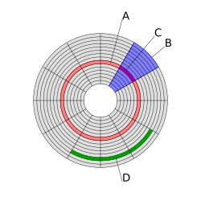

# Glosario

---

Este glosario recoge conceptos clave relacionados con UEFI, BIOS, particiones, sistemas de archivos y arranque, con explicaciones ampliadas, ejemplos y diagramas simplificados.

---

## Arranque
El **arranque** es el proceso por el cual un ordenador pasa de estar apagado a ejecutar un sistema operativo.  
Incluye varias fases:

1. **POST (Power-On Self Test):** comprobaciones de hardware (RAM, CPU, dispositivos básicos).  
2. **Firmware (BIOS/UEFI):** inicializa hardware y busca un medio de arranque válido.  
3. **Gestor de arranque:** programa que indica qué sistema operativo o kernel cargar.  
4. **Carga del kernel:** el sistema operativo toma el control del hardware.  

```
[Encendido] → [POST] → [Firmware] → [Gestor de arranque] → [Kernel] → [Sistema operativo]
```

Ejemplo: En un PC moderno con UEFI, el firmware busca en la **partición EFI (ESP)** un archivo `.efi` (por ejemplo, `grubx64.efi`) y lo ejecuta.

---

## BCD (Boot Configuration Data)
El **BCD** es la base de datos de configuración de arranque de Windows, que sustituye al antiguo `boot.ini`.  
Se guarda en la partición EFI (**ESP**) y es gestionado por `Windows Boot Manager`.  

Herramientas:
- `bcdboot`: genera los ficheros de arranque.  
  ```bash
  bcdboot C:\Windows /s S: /f UEFI
  ```
- `bcdedit`: permite inspeccionar y modificar las entradas del BCD.  

Ejemplo de consulta con `bcdedit`:
```
Windows Boot Loader
-------------------
identifier              {current}
device                  partition=C:
path                    \Windows\system32\winload.efi
description             Windows 10
```

---

## BIOS
La **BIOS** (Basic Input/Output System) es el firmware tradicional en PCs (desde 1975).  
Funciones principales:
- Inicializa el hardware.  
- Localiza un dispositivo de arranque.  
- Carga el MBR y transfiere el control.  

**Limitaciones:**
- Máx. discos de 2 TB (por usar direcciones de 32 bits en MBR).  
- Solo 4 particiones primarias.  
- Interfaz básica y lenta.  

Ejemplo visual de arranque BIOS:  
```
[BIOS] → [MBR (primer sector de disco)] → [Bootloader] → [Sistema operativo]
```

---

## Bootloader (Cargador de arranque)
Un **bootloader** es un programa muy pequeño que se ejecuta al inicio del ordenador. Carga el núcleo del sistema 
operativo (kernel) en memoria y le da el control. Se encuentra en el **primer sector del disco (MBR)** o en 
la **partición EFI (UEFI)**.

Es común que, al ser un código muy pequeño, el bootloader cargue un segundo bootloader más completo (como GRUB2) 
al que se suele llamar [gestor de arranque](99-glosario.md#gestor-de-arranque) y
que permita seleccionar entre varios sistemas operativos, entre otras cosas. Esta estructura de dos fases es típica
en sistemas **BIOS/MBR**.

Así, el gestor de arranque puede tener sus propios bootloaders para cada sistema operativo instalado que ya 
cargan el kernel correspondiente.

De modo que, por precisar, se va distinguir entre **cargador** (muy pequeño y directo para cargar un kernel o similar) 
y **gestor** de arranque (más completo).

**Estructrura típica en MBR**:

```text
+---------------------------+
| Primer sector del disco   |
| (512 bytes)               |
+---------------------------+
| Código de arranque        | <- Bootloader
+---------------------------+
| Tabla de particiones      | <- Máx. 4 entradas
+---------------------------+
    │
    ▼
Partición activa / Núcleo del SO
    │
    ▼
Sistema operativo cargado

```

**Flujo de arranque**:

1. La BIOS/UEFI lee el primer sector del disco.
2. Localiza y ejecuta el bootloader.
3. El bootloader analiza la tabla de particiones o la partición EFI.
4. Carga el núcleo del sistema operativo (o el de un gestor de arranque) en memoria y transfiere el control.

---

## EFI (Extensible Firmware Interface)
Desarrollada por Intel en 2000 para Itanium, reemplazó la BIOS clásica.  
Ventajas frente a BIOS:
- Soporte para discos grandes (GPT).  
- Entorno modular y extensible.  
- Drivers cargables en tiempo de arranque.  

Ejemplo: Apple usó EFI antes de la estandarización como UEFI.

---

## ESP (EFI System Partition)
La **partición del sistema EFI** (ESP) es obligatoria en discos con GPT para sistemas que usen UEFI.  

Características:
- Formato: FAT32.  
- Tamaño habitual: 100-550 MB.  
- Contiene bootloaders, drivers y ficheros `.efi`.  

Ejemplo de estructura de ESP:
```
/EFI
 ├── Microsoft/Boot/bootmgfw.efi
 ├── Boot/bootx64.efi
 └── grub/grubx64.efi
```

---

## Estructura de un disco

Un disco (HDD o SSD) se organiza en **unidades jerárquicas de almacenamiento** que permiten al sistema operativo gestionar la información.  

A grandes rasgos:

- **Sector**: unidad física mínima que gestiona el disco (512B o 4K).  
- **Bloque / Clúster**: agrupación de sectores utilizada por el sistema de archivos (ej. 4K, 8K, 64K).  
- **Pista y cilindro (en HDD)**: divisiones físicas circulares en los platos de un disco duro.  
- **Archivo**: se construye combinando varios bloques o clústeres.  

**Esquema global**

```text
Disco
├── Platos (en HDD) o chips NAND (en SSD)
│ └── Pistas → Sectores (512B / 4K)
│
└── Sistema de Archivos
└── Bloques o Clústeres (agrupan sectores)
└── Archivos y directorios
```

<!--
|
A es una pista del disco (roja),
B es un sector geométrico (azul)
C es un sector de una pista (magenta)
D es un grupo de sectores o clúster (verde)
-->

| Imagen | Explicación                                                                                                                                                                                                                                                                                                                               |
|--------|-------------------------------------------------------------------------------------------------------------------------------------------------------------------------------------------------------------------------------------------------------------------------------------------------------------------------------------------|
|  | - <span style="color:red;"><strong>A</strong></span>: una pista del disco <br>- <span style="color:blue;"><strong>B</strong></span>: un sector geométrico<br> - <span style="color:magenta;"><strong>C</strong></span>: un sector de una pista<br> - <span style="color:green;"><strong>D</strong></span>: un grupo de sectores o clúster |


**Idea clave**:

- El **sector** es la pieza más pequeña (el “ladrillo”).  
- Los **bloques o clústeres** son conjuntos de sectores (la “pared”).  
- Los **archivos** se almacenan usando múltiples bloques (el “edificio”). 

---

## Firmware UEFI

Es la implementación del estándar **UEFI** (Unified Extensible Firmware Interface) que está codificada y almacenada 
**en un chip de memoria no volátil** (flash ROM) en la placa base del ordenador.

---

## Formato / Formatear
**Formatear** es preparar una unidad o partición para almacenar datos creando un **sistema de archivos**.  

El **formato** determina la estructura de almacenamiento, compatibilidad y características del sistema de archivos.

> Formatear una partición con ext4 en Linux:
> ```bash
> mkfs.ext4 /dev/sda2
> ```
> Ejemplo: Formatear una partición con FAT32 en Linux:
> ```bash
> mkfs.fat -F32 /dev/sda1
> ```
> Formatear una partición con NTFS en Windows:
> ```powershell
> format D: /FS:NTFS
> ```

---

## Gestor de arranque
Un **gestor de arranque** permite seleccionar y cargar sistemas operativos.  

Ejemplos:

- **GRUB2**: usado en Linux.  
- **Windows Boot Manager**: carga Windows.  
- **rEFInd**: alternativo y multiplataforma.  

Ejemplo visual:  
```
UEFI → grubx64.efi → menú de GRUB → elegir Ubuntu → cargar kernel Linux
```

---

## GPT (GUID Partition Table)
Tabla de particiones moderna, usada con UEFI.  

Características:
- Identifica particiones con GUID (identificadores únicos).  
- Soporta discos de hasta 9.4 ZB.  
- Hasta 128 particiones en Windows (sin necesidad de particiones extendidas).  

Ejemplo visual de disco GPT (3 particiones):
```
[ ESP | Partición Linux | Partición Datos ]
```

---

## LBA (Logical Block Addressing)
Internamente un disco está dividido en areas llamadas **sectores** (normalmente 512 bytes o 4K). 

Cada sector tiene una **dirección única** (un número) que permite al sistema operativo leer o escribir datos en esa 
ubicación específica. 

Antes se usaba el sistema **CHS (Cylinder-Head-Sector)** para direccionar sectores y que se expresaban con 24 bits, 
lo que da lugar a limitaciones para discos grandes (típicamente, no podía usarse con discos de más de 2TB).

**LBA** es el método de direccionamiento que usa **bloques lógicos** en lugar de sectores físicos y permite superar 
las limitaciones de tamaño de disco (más allá de los 2 TB). El direccionamiento se hace típicamente con 64 bits, 
lo que permite un límite teórico de **8 Zettabytes (ZB)**.

Así, tanto el firmware como sistema operativo interpretan las direcciones **LBA** como bloques lógicos, no como 
sectores físicos. Los bloques se numeran secuencialmente desde `LBA 0` hasta `LBA N-1` (donde N es el número total 
de bloques). Por ejemplo: `LBA 0`, `LBA 1`, `LBA 2`, etc.

---

## MBR (Master Boot Record)
Tabla de particiones tradicional usada con BIOS.  

Características:
- Usa 32 bits → discos hasta 2 TB.  
- 4 particiones primarias.  
- Primer sector del disco (512 bytes) contiene: código de arranque + tabla de particiones.  

Ejemplo visual de disco MBR:
```
[ MBR | Partición 1 | Partición 2 | Partición 3 | Partición 4 ]
```

!!! Nota
    De los 512 bytes, el código de arranque ocupa 446 bytes y la tabla de particiones ocupa 64 bytes.

---

## NVRAM (Non-Volatile Random-Access Memory)

La NVRAM es una pequeña memoria no volátil, típicamente ubicada en la placa base, que guarda la configuración del
firmware UEFI.

Su función clave es **almacenar** las entradas de arranque: un **nombre de entrada** y la **ubicación del 
fichero `.efi`** correspondiente.

Estas entradas pueden ser gestionadas con distintas herramientas como **efibootmgr** (GNU/Linux) o **bcdedit** (Windows).

Ejemplos de entradas almacenadas en **NVRAM**:

| Nombre de entrada    | Ubicación en la ESP              |
|----------------------|----------------------------------|
| Windows Boot Manager | \EFI\Microsoft\Boot\bootmgfw.efi |
| Ubuntu               | \EFI\ubuntu\grubx64.efi          |

---
## Partición
Una **partición** es una división lógica de un disco físico.  
Permite tener distintos sistemas operativos o separar datos.  

Ejemplo:

- Disco de 1 TB:  
     - 200 GB → Windows (Típicamente NTFS)
     - 200 GB → Linux  (Típicamente ext4)
     - 600 GB → Datos compartidos  (Típicamente exFAT o NTFS)

---

## Sistema de archivos
El **sistema de archivos** define cómo se organizan y almacenan los datos dentro de una partición.  

Ejemplos:  
- **FAT32:** usado en ESP (partición EFI) por compatibilidad.  
- **NTFS:** Windows.  
- **ext4:** Linux.  

Diagrama simplificado de un archivo en un FS:  
```
[Tabla de inodos] → [Bloques de datos]
archivo.txt → apunta a → bloque #123, bloque #124...
```

---

## Unidad
El término **unidad** puede referirse a:

1. Un dispositivo físico de almacenamiento (ej. disco duro, SSD, pendrive).  
2. Una partición lógica identificada por el sistema operativo (ej. C:, /dev/sda1).  

Ejemplo en Linux:
```
Dispositivo físico: /dev/sda
Particiones: /dev/sda1, /dev/sda2
```

Ejemplo en Windows:
```
Disco físico 0
  C: → Sistema
  D: → Datos
```

---

## UEFI (Unified Extensible Firmware Interface)
Estandarización de EFI (2005 en adelante).  
Especificación que reemplaza BIOS con un entorno modular y moderno.  

Características:  
- Interfaz gráfica posible (mouse y drivers).  
- Soporte para GPT.  
- Entorno de prearranque con aplicaciones `.efi`.  

Ejemplo: instalar Linux en modo UEFI requiere crear una partición ESP.


