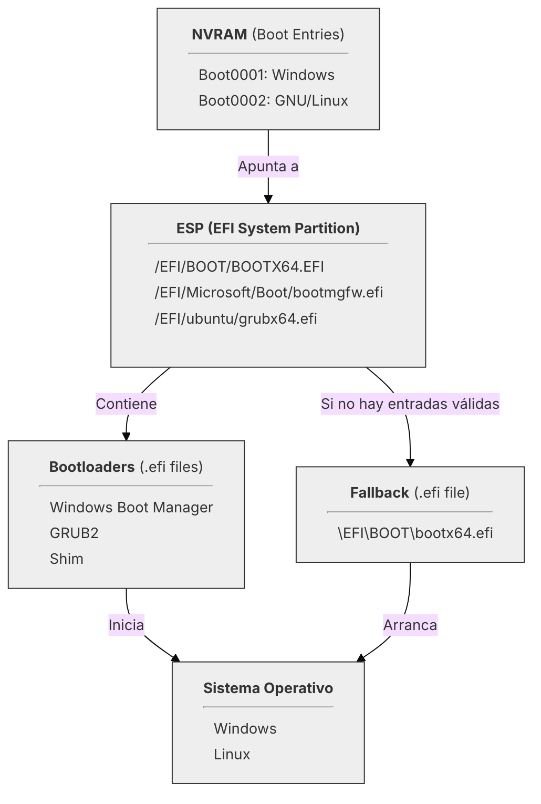

# Entendiendo UEFI

---

## 3. Gestión del registro de arranque UEFI (NVRAM)

Como hemos visto anteriormente, la [**NVRAM**](99-glosario.md#nvram-non-volatile-random-access-memory) es una memoria,
normalmente integrada en la placa base y de naturaleza no volátil, que almacena las **entradas de arranque** (_boot
entries_).

Cuando se instala un sistema operativo, este crea una entrada en la NVRAM que le indica al 
[**firmware UEFI**](99-glosario.md#firmware-uefi) lo siguiente:

- **Ruta** del [**cargador de arranque**](99-glosario.md#bootloader-cargador-de-arranque) (`.efi` dentro de la 
[**ESP**](99-glosario.md#esp-efi-system-partition)).
- **Nombre de la entrada** que aparecerá en el menú de arranque.

La **gestión de la NVRAM** se centra en manipular esa lista de entradas para poder _añadir_, _eliminar_ y _reordenar_ estos
registros permitiendo al usuario controlar el arranque de sus sistemas sin necesidad de reinstalarlos.

Este capítulo se enfoca en el uso de las herramientas más comunes para este fin, tanto dentro del mundo Windows como del
mundo GNU/Linux.


