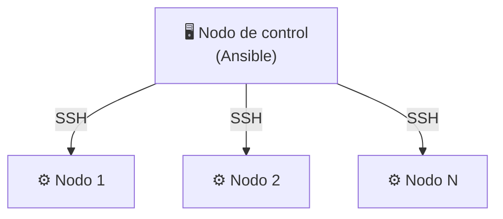

# Ansible

---

## 2. Instalación y entorno de pruebas

Antes de instalar nada, conviene tener clara la arquitectura básica de Ansible. Hay dos tipos de máquinas:

- **Nodo de control**: la máquina desde la que se ejecuta Ansible y donde se instala. Desde aquí se lanzan
  los comandos y playbooks.
- **Nodos gestionados**: las máquinas sobre las que Ansible actúa. No requieren ningún software adicional,
  solo Python (o un intérprete compatible) y un servidor SSH accesible.

La comunicación es siempre en la misma dirección: el nodo de control se conecta a los nodos gestionados,
nunca al revés.



### 2.1 Instalación de Ansible

En Debian o derivados (Ubuntu, Linux Mint...), la instalación se realiza con los siguientes comandos como root:

```bash title="Instalación"
# apt update && apt upgrade
# apt install ansible
```
???+ note "Nota"
        El primer comando actualiza la información de los repositorios y los paquetes instalados. Simplemente, es 
        recomendable, no es estrictamente necesario.

Para verificar que la instalación se ha completado correctamente:

```bash title="Verificación"
# ansible --version
```

Esto mostrará la versión instalada junto con información sobre la configuración por defecto, como la ubicación
del archivo de configuración o la versión de Python que Ansible utilizará.

### 2.2 Autenticación con clave pública y privada

Ansible se conecta a las máquinas gestionadas por SSH, y la forma recomendada de autenticarse es mediante un
par de claves pública/privada, en lugar de contraseña. Conviene entender brevemente cómo funciona este mecanismo.

Cuando se genera un par de claves SSH, se obtienen dos archivos:

- **Clave privada**: permanece en el nodo de control y no debe compartirse nunca. Es la parte secreta.
- **Clave pública**: se copia a cada máquina gestionada. No es secreta; de hecho, está diseñada para distribuirse.

Cuando Ansible intenta conectarse a una máquina remota, el servidor SSH comprueba si la clave pública del
cliente está en su lista de claves autorizadas. Si es así, permite la conexión sin necesidad de contraseña.
Esto es más seguro que usar contraseña y, además, permite que Ansible opere de forma completamente desatendida
y automatizada.

Para generar el par de claves en el nodo de control:

```bash title="Generación del par de claves"
# ssh-keygen
```

El comando pedirá una ruta donde guardar las claves (por defecto `~/.ssh/id_rsa` y `~/.ssh/id_rsa.pub`) y,
opcionalmente, una contraseña para proteger la clave privada. Para uso con **Ansible** se puede dejar en blanco.

A continuación, se copia la clave pública a cada máquina gestionada:

```bash title="Copia de la clave pública"
# ssh-copy-id root@192.168.12.XX
```

Esto añadirá la clave pública al archivo `~/.ssh/authorized_keys` del usuario `root` en la máquina remota.
Para verificar que la autenticación funciona correctamente:

```bash title="Verificación"
# ssh root@192.168.12.XX
```

Si la conexión se establece sin pedir contraseña, el sistema está listo para que Ansible opere sobre esa máquina.

???+ note "Usuarios para Ansible"
    Ansible necesita las credenciales de un usuario para conectarse por SSH a los nodos gestionados. Puede
    usarse cualquier usuario, pero dado que muchas tareas de administración requieren privilegios elevados,
    en este manual se utilizará directamente el usuario `root`, lo que simplifica la configuración en un
    entorno de aprendizaje. En un entorno de producción suele utilizarse un usuario normal con permisos sudo.

### 2.3 Inventario

Ansible necesita saber a qué máquinas debe conectarse. Esta información se define en el **inventario**: un
archivo de texto que lista los hosts gestionados y, opcionalmente, los agrupa por función o entorno.

Por defecto, Ansible busca el inventario en `/etc/ansible/hosts`. Si el directorio no existe, hay que crearlo:

```bash title="Creación del directorio de configuración"
# mkdir /etc/ansible
```

```ini title="/etc/ansible/hosts"
[servidores_web]
192.168.12.11
192.168.12.12

[bases_de_datos]
192.168.12.21
```

Los nombres entre corchetes definen **grupos**, que permiten aplicar tareas a conjuntos de máquinas de forma
selectiva. Una misma máquina puede pertenecer a varios grupos.

Para comprobar que Ansible alcanza correctamente todas las máquinas del inventario, se puede usar el módulo
`ping`:

```bash title="Prueba de conectividad"
# ansible all -m ping
```

Si todo está bien configurado, cada host responderá con `pong`.

???+ tip "El grupo `all`"
    `all` es un grupo especial que existe siempre de forma implícita y engloba todos los hosts del inventario,
    sin necesidad de declararlo.

???+ note "Nota"
     Para quienes tengan conocimientos de redes: el módulo `ping` no utiliza **ICMP** sino un pequeño script 
     de **Python**.

### 2.4 Comandos ad-hoc y módulos

El comando anterior es un ejemplo de **comando ad-hoc**: una orden puntual que Ansible ejecuta directamente
desde la línea de comandos, sin necesidad de escribir un playbook. Su formato general es:

```bash
ansible <hosts> -m <módulo> -a "<argumentos>"
```

Donde:

- `<hosts>` es el grupo o máquina del inventario sobre el que se actuará (`all` selecciona todas las máquinas).
- `-m <módulo>` indica el módulo de Ansible que se va a usar.
- `-a "<argumentos>"` permite pasar parámetros al módulo (opcional según el módulo).

Un **módulo** es la unidad de trabajo de Ansible: un pequeño programa que sabe cómo realizar una tarea concreta
(instalar un paquete, copiar un archivo, reiniciar un servicio, comprobar conectividad...). Ansible incluye
cientos de módulos para las tareas más habituales de administración de sistemas, y es posible escribir módulos
propios si se necesita algo específico. Los veremos en detalle más adelante; como muestra de su versatilidad,
el módulo `shell` permite ejecutar directamente cualquier comando en los hosts remotos, prácticamente igual 
que si el administrador ejecutara el comando tras conectarse por SSH:

```bash title="Ejemplos con el módulo shell"
# ansible all -m shell -a "df -h"
# ansible all -m shell -a "uptime"
```

???+ warning "Módulo `shell` e idempotencia"
    El módulo `shell` ejecuta comandos directamente en el sistema remoto, por lo que Ansible no puede
    garantizar idempotencia: si se ejecuta dos veces, el comando se ejecuta dos veces. Siempre que Ansible
    tenga un módulo específico para la tarea en cuestión es preferible usarlo.

