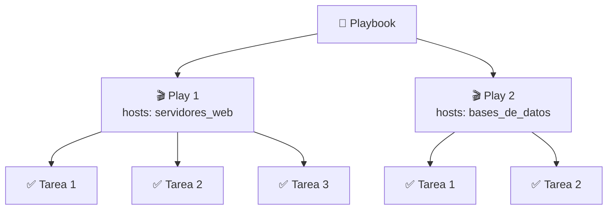

# Ansible

---

## 4. Playbooks, YAML e inventario

### 4.1 Qué es un playbook

Antes de ver cómo se escribe un playbook conviene entender qué es, y sobre todo qué **no** es.

Un playbook **no es un script**. Un script es una lista de instrucciones que se ejecutan en orden, una tras
otra, sin importar el estado del sistema. Si algo ya está hecho, el script lo hace igualmente. Si algo falla
a mitad, el resto puede quedar en un estado inconsistente.

Un playbook no es un script, sino una definición declarativa de tareas que Ansible ejecuta para llevar uno o
varios sistemas a un estado deseado. En lugar de decirle a Ansible *"ejecuta estos comandos"*, se le 
dice *"el sistema debe quedar así después de esta tarea"*. Ansible se encarga de averiguar qué diferencia
hay entre el estado actual y el estado deseado, y de aplicar solo los cambios necesarios para alcanzarlo.
Si el sistema ya está en el estado correcto, Ansible no hace nada.

Esta distinción tiene consecuencias prácticas importantes:

- Un playbook puede ejecutarse varias veces sin riesgo de efectos no deseados (**idempotencia**).
- Si una ejecución falla a mitad, volver a ejecutar el playbook lleva el sistema al estado correcto sin
  necesidad de deshacer nada manualmente.
- El propio playbook sirve como **documentación** del sistema: leyéndolo se sabe exactamente cómo debe
  estar configurado.

Un playbook puede contener uno o varios **plays**. Cada play define sobre qué máquinas actuar y qué tareas
realizar en ellas. Las tareas, a su vez, invocan módulos de Ansible, los mismos que ya hemos visto en los
comandos ad-hoc.



### 4.2 YAML

Los playbooks de Ansible se escriben en **YAML** (*YAML Ain't Markup Language*), un formato de texto
diseñado para ser fácil de leer y escribir por personas. Nació como alternativa simplificada a XML: donde
XML usa etiquetas de apertura y cierre, YAML usa sangría y caracteres especiales mínimos.

Un archivo YAML comienza con tres guiones (`---`), que marcan el inicio del documento:

```yaml
---
```

Es opcional pero muy recomendable incluirlos, y en Ansible es una convención universal.

#### Clave-valor

La estructura básica de YAML es el par **clave: valor**, separados por dos puntos y un espacio:

```yaml
---
nombre: Ansible
versión: 2.16
activo: true
```

Los valores pueden ser texto, números, booleanos o estructuras más complejas (YAML admite varias 
representaciones válidas de booleanos).

#### Objetos (diccionarios)

Los objetos anidan claves dentro de otras claves mediante **sangría**. La sangría es significativa en YAML:
elementos al mismo nivel de sangría pertenecen al mismo objeto. Se recomienda usar **dos espacios** (nunca
tabuladores):

```yaml
---
servidor:
  nombre: web01
  ip: 192.168.12.11
  activo: true
```

Aquí `nombre`, `ip` y `activo` son propiedades del objeto `servidor`.

#### Listas (arrays)

Las listas se representan con un guion y un espacio (`- `) delante de cada elemento:

```yaml
---
paquetes:
  - nginx
  - curl
  - git
```

Para listas cortas existe también la notación en una sola línea con corchetes:

```yaml
---
paquetes: [nginx, curl, git]
```

Las listas pueden contener objetos, y los objetos pueden contener listas, lo que permite representar
estructuras de cualquier complejidad:

```yaml
---
servidores:
  - nombre: web01
    ip: 192.168.12.11
  - nombre: web02
    ip: 192.168.12.12
```

#### Comentarios

Los comentarios se introducen con `#` y pueden aparecer en cualquier línea:

```yaml
---
# Configuración principal
servidor:
  nombre: web01  # nombre del host
  ip: 192.168.12.11
```

???+ warning "La sangría en YAML"
    YAML es **muy estricto** con la sangría. Un espacio de más o de menos puede cambiar el significado del
    archivo o producir un error. Usar siempre dos espacios (nunca tabuladores) y mantener la coherencia a
    lo largo de todo el archivo evita la mayoría de los problemas. La mayoría de editores modernos permiten
    configurar la tecla ++tab++ para que inserte espacios automáticamente.

???+ tip "Validar YAML"
    Antes de ejecutar un playbook, puede comprobarse que el YAML es sintácticamente correcto con:
    ```bash
        # ansible-playbook --syntax-check <playbook.yml>
    ```
    También existen validadores online como [yamllint.com](https://www.yamllint.com){ target="_blank" }
    que resultan útiles durante el aprendizaje.

### 4.3 El inventario en detalle

Ya se introdujo el inventario en el apartado 2.3 como un archivo que lista los hosts gestionados. Aquí se
verá con más detalle, porque un inventario bien estructurado es la base sobre la que se organizan todos los
playbooks.

El formato por defecto es **INI**, el mismo que se usó en el ejemplo inicial.

#### Hosts sin grupo

Es posible declarar hosts fuera de cualquier grupo. Estarán disponibles bajo el grupo implícito `all` pero
no bajo ningún grupo con nombre:

```ini title="/etc/ansible/hosts"
192.168.12.10
servidor-bastion.ejemplo.com
```

En la práctica, es recomendable agrupar siempre los hosts para poder dirigir las tareas con precisión.

#### Grupos

Los grupos se declaran con el nombre entre corchetes. Todos los hosts bajo ese encabezado pertenecen al
grupo hasta el siguiente encabezado:

```ini title="/etc/ansible/hosts"
[servidores_web]
192.168.12.11
192.168.12.12

[bases_de_datos]
192.168.12.21
192.168.12.22
```

#### Grupos de grupos: `children`

Un grupo puede contener a otros grupos usando el sufijo `:children`. Esto permite crear jerarquías y
dirigir tareas a conjuntos más amplios sin repetir hosts:

```ini title="/etc/ansible/hosts"
[servidores_web]
192.168.12.11
192.168.12.12

[bases_de_datos]
192.168.12.21
192.168.12.22

[produccion:children]
servidores_web
bases_de_datos
```

Con este inventario, un playbook dirigido a `produccion` actuará sobre todos los hosts de `servidores_web`
y `bases_de_datos`.

???+ note "Nota"
    Un host nunca se duplica, es decir, pertenece a varios grupos sin repetirse.

#### Variables de host y de grupo

El inventario permite asignar variables a hosts o grupos concretos usando el sufijo `:vars`. Estas variables
estarán disponibles en los playbooks cuando se actúe sobre esos hosts, salvo que se sobrescriban explícitamente 
en el propio playbook:

```ini title="/etc/ansible/hosts"
[servidores_web]
192.168.12.11
192.168.12.12

[servidores_web:vars]
ansible_user=root
http_port=80

[bases_de_datos]
192.168.12.21 ansible_user=root db_port=5432
192.168.12.22 ansible_user=root db_port=5432
```

Las variables pueden definirse a nivel de grupo (con `:vars`) o directamente junto al host en la misma
línea, como se ve en el ejemplo de `bases_de_datos`.

Algunas variables tienen un significado especial para Ansible:

| Variable | Descripción |
|----------|-------------|
| `ansible_user` | Usuario con el que Ansible se conecta por SSH |
| `ansible_port` | Puerto SSH (por defecto 22) |
| `ansible_host` | IP o nombre real del host (útil si el nombre en el inventario es un alias) |
| `ansible_ssh_private_key_file` | Ruta a la clave privada SSH a usar |

???+ tip "Inventarios en YAML"
    El inventario también puede escribirse en formato YAML, lo que resulta más legible en proyectos
    complejos. El formato INI es suficiente para empezar y es el más habitual en documentación y ejemplos,
    por lo que es el que se usará en este manual.

???+ note "Separar variables del inventario"
    En proyectos reales se recomienda no definir variables directamente en el archivo de inventario, sino
    en directorios separados (`host_vars/` y `group_vars/`) donde cada host o grupo tiene su propio archivo
    YAML. Esto facilita el mantenimiento y el control de versiones. Se verá en detalle más adelante.

