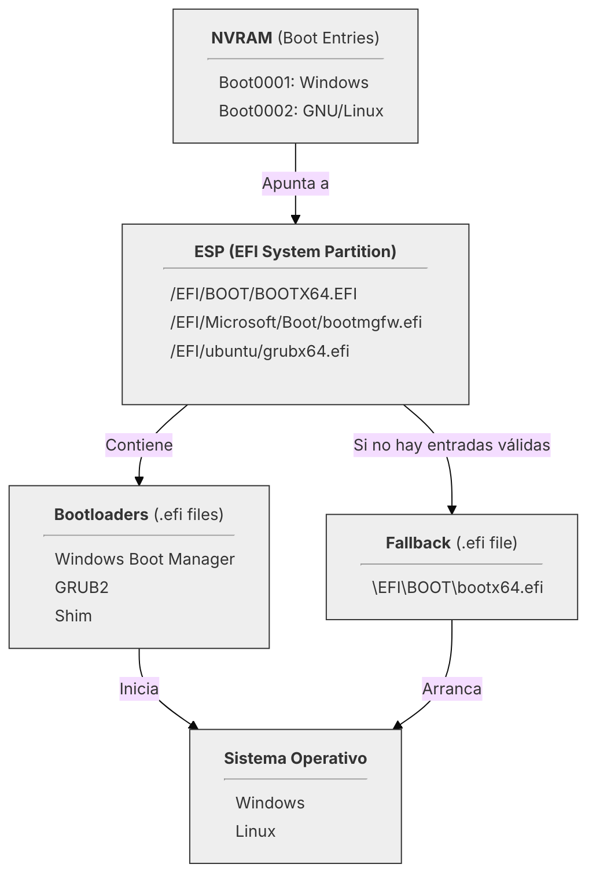
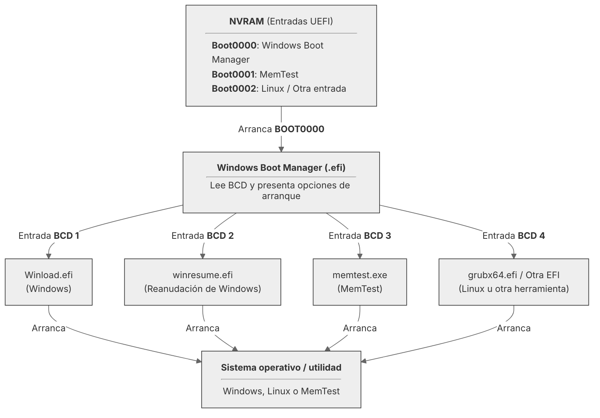

# Entendiendo UEFI

---

## 3. Gestión del registro de arranque UEFI (NVRAM)

Como hemos visto anteriormente, la [**NVRAM**](99-glosario.md#nvram-non-volatile-random-access-memory) es una memoria,
normalmente integrada en la placa base y de naturaleza no volátil, que almacena las **entradas de arranque** (_boot
entries_).

Cuando se instala un sistema operativo, este crea una entrada en la NVRAM que le indica al 
[**firmware UEFI**](99-glosario.md#firmware-uefi) lo siguiente:

- **Ruta** del [**cargador de arranque**](99-glosario.md#bootloader-cargador-de-arranque) (`.efi` dentro de la 
[**ESP**](99-glosario.md#esp-efi-system-partition)).
- **Nombre de la entrada** que aparecerá en el menú de arranque.

La **gestión de la NVRAM** se centra en manipular esa lista de entradas para poder _añadir_, _eliminar_ y _reordenar_ estos
registros permitiendo al usuario controlar el arranque de sus sistemas sin necesidad de reinstalarlos.

Este capítulo se enfoca en el uso de las herramientas más comunes para este fin, tanto dentro del mundo Windows como del
mundo GNU/Linux.

<div style="text-align: center">


</div>

---

### 3.1 Herramientas de gestión en sistemas modernos

La mayoría de los **firmware UEFI** permiten gestionar de una manera limitada las entradas de la NVRAM desde el propio 
[setup de la BIOS]("Término heredado: se refiere a la interfaz de configuración del firmware, que en realidad es UEFI."),
por ejemplo, para cambiar el orden de arranque o deshabilitar alguna entrada. Los sistemas 
operativos modernos disponen además de herramientas en línea de comandos que permiten un control mucho más exhaustivo, preciso y
flexible sobre las rutas y nombres de entradas, lo cual es esencial para una configuración precisa y un diagnóstico
efectivo.

Las dos herramientas que abordaremos en detalle son:

1. **`bcdedit`** (en Windows): Herramienta originalmente concebida para la _configuración de arranque de los sistemas 
Windows_ que hubiera en una máquina, pero extendida para gestionar la **NVRAM**.
2. **`efibootmgr`** (en GNU/Linux): simple y potente herramienta de código abierto que permite la interacción con las
entradas almacenadas en la **NVRAM**.

---

#### 3.1.1 `bcdedit` en Windows

`bcdedit` (_Boot Configuration Data Editor_) es una herramienta de línea de comandos incluida en Windows que permite
gestionar las configuraciones de arranque del sistema. Permite interactuar tanto con el [**BCD**](99-glosario.md#bcd-boot-configuration-data) 
(_Boot Configuration Data_) (Su función principal), como con las entradas registradas en la 
[**NVRAM**](99-glosario.md#nvram-non-volatile-random-access-memory) (una función 
secundaria, pero muy útil, pues cubre la mayoría de necesidades habituales).

##### 3.1.1.1 BCD vs NVRAM: Dos capas de arranque diferentes 

Ya que `bcdedit` trabaja sobre el **BCD** y sobre la **NVRAM**, conviene aclarar la diferencia entre ambas capas:

- **BCD** es una _base de datos_ (normalmente el archivo `\EFI\Microsoft\Boot\BCD`) que contienen la configuración 
de arranque específica de Windows. Habitualmente incluye dos tipos de entradas:
 
    - **Cargadores de SO**: Detallan las opciones y los parámetros para iniciar los sistemas operativos Windows (ubicación
  del kernel, opciones de depuración, información sobre el entorno donde se ejecuta, etc.).
      - **Representaciones de Firmware**: Entradas especiales para **reflejar o sincronizar** el contenido de la NVRAM 
dentro del propio Windows.

##### 3.1.1.2 La acción de `bcdedit`

`bcdedit` permite gestionar ambas capas por separado:

- **Gestión del BCD**: Crear, modificar y eliminar entradas relacionadas con los cargadores de arranque de Windows.
??? note "No es el foco principal de este manual"
    Ya que el tema que nos ocupa principalmente es lo relacionado con 
    [**UEFI**](99-glosario.md#uefi-unified-extensible-firmware-interface), no se profundiza en el uso de `bcdedit` para
    gestionar el **BCD**.
- **Gestión de la NVRAM**: Consultar y modificar las entradas de arranque almacenadas en la NVRAM del firmware UEFI
(especialmente el orden de arranque).

<div style="margin-top: 30px; text-align: center">



</div>

??? failure "Windows Boot Manager **NO** arranca cualquier `.efi`"
    A diferencia de **firmware UEFI**, el **Windows Boot Manager** no está diseñado para arrancar cualquier
    archivo `.efi` arbitrario. Solo puede iniciar los cargadores de arranque específicos de Windows (como `winload.efi`),
    algunas herramientas de diagnóstico proporcionadas por Microsoft (como `memtest.exe`) y herramientas específicamente
    diseñadas para **Windows Boot Manager**.
    Lo expuesto arriba es el modelo teórico de cómo funciona `bcdedit` y el **BCD** en relación con la **NVRAM**, pero en 
    la práctica, en el **BCD** solo deben registrarse entradas relacionadas con Windows y sus herramientas oficiales, es
    decir, ese **grubx64.efi** que arrancaría un SO GNU/Linux, **no funcionará** a priori si se intenta iniciar a través
    del **BCD**.

##### 3.1.1.3 Uso de `bcdedit`

`bcdedit` debe ejecutarse con **privilegios de administrador** desde una ventana de _PowerShell_ o _Símbolo del sistema_.

Su forma de uso general es:

```powershell
bcdedit /command [opciones]
```

Donde `/command` es la acción que se desea realizar (como `/enum`, `/set`, `/delete`, etc.) y `[opciones]` son los
parámetros específicos para esa acción. (En la sección 3.2 se detallan algunas de estas operaciones).

??? note "Obtener ayuda sobre `bcdedit`"
    Para obtener una lista completa de comandos y opciones disponibles en `bcdedit`, se puede ejecutar:
    ```powershell
    bcdedit /?
    ```
    Y si se quiere ayuda sobre un comando específico
    ```powershell
    bcdedit /? <command>
    ```

??? note "Documentación oficial de `bcdedit` (Windows 11)"
    Para más detalles sobre `bcdedit`, se puede consultar la documentación oficial de Microsoft:
    [Microsoft Docs](https://learn.microsoft.com/es-es/windows-hardware/manufacture/desktop/bcdedit-command-line-options?view=windows-11)

---

#### 3.1.2 `efibootmgr` en GNU/Linux

`efibootmgr` es una herramienta de línea de comandos que permite gestionar las entradas de arranque
almacenadas directamente en la **NVRAM** del **firmware UEFI**. Es la utilidad nativa y estándar para este fin en la 
mayoría de las distribuciones **GNU/Linux**.

Debe ejecutarse con **privilegios de superusuario** (usando `sudo` o como `root`) desde una terminal.

Su forma de uso general es:

```bash
efibootmgr [opciones]
```

A diferencia de `bcdedit` (que trabaja sobre el BCD), `efibootmgr` interactúa de forma directa y minimalista con la
capa de *firmware* para consultar y manipular los registros de arranque.

Pero antes de ver las operaciones más comunes, es importante entender que `efibootmgr` trabaja sobre lo que se conoce
como **variables EFI** (`EFI_VARS`):

##### 3.1.2.1 Variables EFI (`EFI_VARS`)
En sistemas **UEFI** la configuración del arranque, las entradas registradas y otras opciones del firmware se 
almacenan como **variables EFI** en la **NVRAM**. Estas variables son accesibles desde el sistema operativo mediante 
un sistema de archivos virtual montado en GNU/Linux llamado **`efivarfs`** o **`efivars`**.

- Cada variable EIF tiene un **nombre** y un **valor** (es una clave identificador/valor).
- Algunas variables importantes a modo de ejemplo:
  - **`BootOrder`**: Contiene el orden de prioridad de las entradas de arranque.
  - **`BootXXXX`**: Donde `XXXX` es un número hexadecimal que identifica cada entrada de arranque individual.
  - **`Timeout`**: Define el tiempo de espera antes de arrancar la entrada por defecto.
  - **`BootCurrent`**: Indica la entrada que se está utilizando actualmente para arrancar.
  - **`BootNext`**: Permite especificar una entrada de arranque para la próxima vez que se inicie el sistema.

Estas variables corresponden directamente a lo que `efibootmgr` lee y modifica.

##### 3.1.2.2 Partición `efivars`
Las **variables EFI** se exponen al sistema operativo a través de un **sistema de archivos virtual** llamado **`efivars`**. 
Para que `efibootmgr` funcione correctamente, es necesario que este sistema de archivos esté montado en el sistema.

???+ danger "Montaje de `efivars`"
    En la mayoría de las distribuciones modernas, el sistema de archivos `efivars` se monta automáticamente al 
    iniciar el sistema. 

Si por alguna razón no está montado, se puede montar manualmente con el siguiente comando:

```bash
mount -t efivarfs efivarfs /sys/firmware/efi/efivars
```

Y si se quiere comprobar si está montado:

```bash
mount | grep efivars
``` 

Al tratarse de un sistema de archivos virtual, no ocupa espacio en disco y no es persistente entre reinicios, pero se
puede usar para interactuar con las variables EFI desde el sistema operativo. Por ejemplo:

Se pueden listar las variables EFI:

```bash
ls /sys/firmware/efi/efivars/
```

Ver el contenido de una variable específica:

```bash 
hexdump -C /sys/firmware/efi/efivars/BootOrder-*
```

??? note "Modificar variables EFI directamente"
    Aunque es posible modificar las variables EFI directamente a través del sistema de archivos `efivarfs`, **no es 
    recomendable** hacerlo manualmente, ya que un error podría corromper la configuración del firmware y hacer que el 
    sistema no arranque correctamente. Es preferible usar herramientas como `efibootmgr` para gestionar estas variables
    de forma segura.

##### 3.1.2.3 Copia de seguridad de la NVRAM
Antes de realizar cambios en las entradas de arranque, es recomendable **hacer una copia de seguridad de las 
variables EFI**. 

Primero, se extrae un **backup textual de las entradas** con `efibootmgr`:

```bash
efibootmgr -v > ~/nvram_backup.txt
```

Esto guarda todas las entradas de arranque (Boot IDs, etiquetas y rutas .efi) en un archivo legible.

??? note "Ventaja del backup textual"
    - Permite restaurar las entradas de forma segura usando `efibootmgr`.
    - Sirve como registro de configuración antes de cambios importantes.
    - Es independiente de la distribución y no requiere manipular directamente **efivars**.

En caso de necesitar **restaurar las entradas**, se pueden usar los datos del archivo de backup para recrearlas con 
`efibootmgr`. Mira más adelantes en la [sección 3.2.3.2](#3232-efibootmgr-gnulinux) para ver cómo **crear nuevas 
entradas** y en la [sección 3.2.2.2](#3222-efibootmgr-gnulinux) para ver cómo **modificar el orden de arranque**.

---

### 3.2 Operaciones fundamentales en la NVRAM

A continuación, se describen algunas de las operaciones más comunes que se pueden realizar con `bcdedit` y `efibootmgr`.

??? note "Diferencias clave entre Powershell y CMD para entender los ejemplos"
    Cuando se ejecuta un comando en Windows es importante tener claro que **PowerShell** y el **Símbolo del sistema 
    (CMD)** tienen diferente manera de interpretar los comandos y sus parámetros. 

    - **{++CMD++}**: Espera el nombre del comando seguido de una cadena con los parámetros que le hagan falta. Así, **CMD** 
    pasa esta cadena tal cual al programa que se ejecuta y este se encarga de parsearla.

    - **{++Powershell++}**: Analiza los argumentos de manera independiente y se los va pasando al programa, por ejemplo, 
    los corchetes `[]` y llaves `{}` tienen un significado especial y deben escaparse si se quieren
    usar literalmente.

    La sintaxis que se emplea en este documento está adaptada para **Powershell** de manera que **se añaden comillas 
    dobles** `"` alrededor de los parámetros que contienen caracteres especiales. **Estas comillas no son necesarias en
    CMD**.

---

#### 3.2.1 Visualizar las entradas de arranque existentes

Se trata de mostrar las **entradas de arranque almacenadas**, incluyendo las _rutas a los cargadores de
arranque_ y _sus identificadores únicos_ [(**GUID**)](99-glosario.md#gpt-guid-partition-table).

##### 3.2.1.1 `bcdedit` (Windows):

De manera genérica, se ejecuta:

```powershell
bcdedit /enum [<tipo>] [/v]
```
Por ejemplo, para listar las entradas de arranque de la NVRAM, se usaría:

```powershell
bcdedit /enum firmware
```

??? note "Explicación de los parámetros"
    Con `/enum` se listan las entradas de arranque tanto las internas de Window (**BCD**) como las externas (**NVRAM**).
    
    `<tipo>` filtra el tipo de entradas a mostrar. Algunas de las opciones disponibles son:
    
    - `all`: Muestra todas las entradas (por defecto).
    - `firmware`: Muestra las entradas de arranque UEFI almacenadas en la NVRAM.
    - `osloader`: Muestra las entradas relacionadas con los cargadores de arranque del sistema operativo.
    - `bootmgr`: Muestra la configuración del gestor de arranque de Windows.
    
    Y la opción `/v` (verbose) proporciona información detallada sobre cada entrada.

??? note "Ejemplo de salida de `bcdedit /enum firmware`"
    ```text
    Administrador de arranque de firmware
    -----------------------------------
    Identificador           {fwbootmgr}
    displayorder            {5f6fbbbe-9a03-11f0-9b9e-806e6f6e6963}      <-- GUIDs de las entradas
                            {b0a48ba0-8ef4-11f0-9b9b-806e6f6e6963}          Están en el orden de 
                            {5f6fbbbd-9a03-11f0-9b9e-806e6f6e6963}          arranque.
                            {fe56e23a-9a20-11f0-9bb2-806e6f6e6963}
                            {bootmgr}
                            {4bce5028-9a17-11f0-9bae-806e6f6e6963}
                            {b0a48ba1-8ef4-11f0-9b9b-806e6f6e6963}
    timeout                 1
    
    Administrador de arranque de Windows
    ----------------------------------
    Identificador           {bootmgr}
    device                  partition=S:
    path                    \EFI\MICROSOFT\BOOT\BOOTMGFW.EFI
    description             Windows Boot Manager
    locale                  en-us
    inherit                 {globalsettings}
    default                 {current}
    resumeobject            {d8ab5b8f-9a0c-11f0-9ba5-049226d1be46}
    displayorder            {current}
    toolsdisplayorder       {memdiag}
    timeout                 0
    
    Aplicación de firmware (101fffff)
    ---------------------------------
    Identificador           {4bce5028-9a17-11f0-9bae-806e6f6e6963}      <-- GUID de las entrada
    device                  partition=S:                                <-- Partición ESP
    path                    \EFI\Part-01-02\Boot\bootmgfw.efi           <-- Ruta al .efi
    description             Part-01-02                                  <-- Descripción de la
                                                                            entrada como se
    Aplicación de firmware (101fffff)                                       mostraría en el
    ---------------------------------                                       menú de arranque.
    Identificador           {5f6fbbbd-9a03-11f0-9b9e-806e6f6e6963}
    description             UEFI: PXE IP6 Realtek PCIe GBE Family Controller 

    Aplicación de firmware (101fffff)
    ---------------------------------
    Identificador           {5f6fbbbe-9a03-11f0-9b9e-806e6f6e6963}
    device                  partition=S:
    path                    \EFI\DEBIAN\GRUBX64.EFI
    description             debian
    
    Aplicación de firmware (101fffff)
    ---------------------------------
    Identificador           {b0a48ba0-8ef4-11f0-9b9b-806e6f6e6963}
    description             UEFI: PXE IP4 Realtek PCIe GBE Family Controller
    
    Aplicación de firmware (101fffff)
    ---------------------------------
    Identificador           {b0a48ba1-8ef4-11f0-9b9b-806e6f6e6963}
    description             UEFI: PXE IP6 Realtek PCIe GBE Family Controller
    
    Aplicación de firmware (101fffff)
    ---------------------------------
    Identificador           {fe56e23a-9a20-11f0-9bb2-806e6f6e6963}
    description             Hard Drive
    ```

##### 3.2.1.2 `efibootmgr` (GNU/Linux)
Para listar las entradas de arranque **UEFI** almacenadas en la **NVRAM** basta con ejecutar:

```bash
efibootmgr
```

Este comando muestra todas las entradas de arranque almacenadas en la **NVRAM**, junto con sus identificadores y 
el orden de prioridad. No requiere parámetros adicionales para una visualización básica.

??? note "Ejemplo de salida de `efibootmgr`"
    ```text
    BootCurrent: 0003
    Timeout: 1 seconds
    BootOrder: 0003,0000
    Boot0000* Windows Boot Manager  HD(2,GPT,c4c56de3-50ca-4443-949e-06ce7f1cdbdc,0xfa000,0x32000)
                                    /File(\EFI\Microsoft\Boot\bootmgfw.efi)57000 [...] 00000400
    Boot0003* ubuntu        HD(2,GPT,c4c56de3-50ca-4443-949e-06ce7f1cdbdc,0xfa000,0x32000)
                            /File(\EFI\ubuntu\shimx64.efi)
    ```
    Donde:

    - **BootCurrent**: Indica la entrada que se está utilizando actualmente para arrancar.
    - **Timeout**: Tiempo en segundos que el firmware espera antes de arrancar automáticamente la entrada por defecto.
    - **BootOrder**: Lista de las entradas de arranque en el orden en que se intentarán iniciar.
    - **BootXXXX**: Cada entrada de arranque, donde `XXXX` es un número hexadecimal único (Boot ID). Incluye el nombre
    descriptivo y la ruta al archivo `.efi` correspondiente.

??? note "Comparativa entre _GUID_ y _Boot ID_"
    Como se puede observar, cada entrada tiene un **Boot ID** (número hexadecimal de 4 dígitos, ej., _0003_) que 
    identifica cada entrada de arranque. Mientras que `bcdedit` usa **GUIDs** para identificar las entradas, 
    `efibootmgr` utiliza estos **Boot IDs**. Ambos identificadores cumplen la misma función: distinguir de forma única
    cada entrada dentro del firmware, aunque su formato sea distinto.

---

#### 3.2.2. Modificar el orden de arranque
Cambiar el orden de arranque permite especificar al **firmware UEFI** qué cargador de arranque debe intentar
iniciar primero. Esta operación requiere el **GUID** en el caso de `bcdedit` o el **número de entrada** en el caso de
`efibootmgr`.

##### 3.2.2.1 `bcdedit` (Windows):
`bcdedit` puede modificar el orden de arranque de en la **NVRAM** y en el **BCD**. Nos centraremos en la **NVRAM**.

Se puede realizar dos acciones distintas:

1. Sobreescribir la lista completa de entradas en el **Firmware Boot Manager ({fwbootmgr})**:
```powershell
bcdedit /set "{fwbootmgr}" displayorder "{GUID1}" "{GUID2}" ...
```

2. Manipular una entrada específica para cambiar su posición en el orden de arranque (ponerla al principio o al final):
```powershell
bcdedit /set "{fwbootmgr}" displayorder "{GUID}" /addfirst
bcdedit /set "{fwbootmgr}" displayorder "{GUID}" /addlast
```

##### 3.2.2.2 `efibootmgr` (GNU/Linux):**

Con `efibootmgr`, se utiliza la opción `-o` para especificar la nueva secuencia de **Boot IDs** 
(los números hexadecimales de 4 dígitos, ej., _0003_).

```bash
sudo efibootmgr -o <BootOrder>
```

Donde `<BootOrder>` es una **lista separada por comas** de los números de las entradas en el orden deseado.

```bash
sudo efibootmgr -o 0003,0000
```

??? warning "Precaución al modificar el orden de arranque con `efibootmgr`"
    Este comando **sobreescribe completamente el orden de arranque**. Asegúrese de incluir todas las entradas que desea 
    mantener, ya que las que no se incluyan serán eliminadas del orden de arranque.

---

#### 3.2.3. Crear una nueva entrada de arranque

En sistemas **UEFI**, se pueden crear y registrar manualmente nuevas entradas a cargadores de arranque
(`.efi`) dentro de la **NVRAM**. Esta operación suele ser necesaria tras una instalación personalizada, al añadir un 
nuevo disco o al recuperar un cargador eliminado. 

En cualquier caso, no suele ser una operación habitual, ya que, como se ha comentado, al instalar un sistema operativo,
este suele encargarse de crear su propia entrada en la NVRAM automáticamente.

##### 3.2.3.1 `bcdedit` (Windows):
`bcdedit` no permite crear nuevas entradas en la **NVRAM** directamente. Solo puede crearlas dentro del **BCD**. Por 
esto, queda fuera del alcance de este manual.

##### 3.2.3.2 `efibootmgr` (GNU/Linux):
`efibootmgr` permite un control mucho más completo sobre las entradas de arranque en la **NVRAM**, permitiendo 
la creación de nuevas entradas.

```bash
sudo efibootmgr -c -d <DISCO> -p <PARTICIÓN> -L "<ETIQUETA>" -l "<RUTA_EFI>"
```

| Opción             | Función                              | Ejemplo                    |
|--------------------|--------------------------------------|----------------------------|
| `-c` \| `--create` | Indica que se va a crear una entrada | _(no procede)_             |
| `-d` \| `--disk`   | El disco que contiene la **ESP**     | `/dev/sda`                 |
| `-p` \| `--part`   | El número de partición de la **ESP** | `1`                        |
| `-L` \| `--label`  | Descripción de la entrada            | `"Mi GNU/Linux"`           |
| `-l` \| `--loader` | Ruta al `.efi` dentro de la **ESP**  | `\EFI\manjaro\grubx64.efi` |

???+ note "Formato de la ruta al cargador `.efi`"
    La ruta al cargador `.efi` debe especificarse **relativa a la raíz de la partición ESP** con **barras invertidas** 
    (`\`), que no es lo habitual en sistemas **GNU/Linux**, pero es el formato que espera `efibootmgr`.

??? note "Ejemplo de creación de una entrada con `efibootmgr`"
    ```bash
    sudo efibootmgr -c -d /dev/sda -p 1 -L "Mi GNU/Linux" -l "\EFI\manjaro\grubx64.efi"
    ```

---

#### 3.2.4 Eliminar entradas obsoletas

Con el tiempo, es posible que se acumulen entradas de arranque que ya no se utilizan o que correspondan a sistemas 
operativos eliminados. Mantener la **NVRAM** limpia evita confusiones durante el arranque.

##### 3.2.4.1 `bcdedit` (Windows):
`bcdedit` no permite eliminar entradas de la **NVRAM** directamente. Solo puede eliminarlas del **BCD**. Por 
esto, queda fuera del alcance de este manual.

##### 3.2.4.2 `efibootmgr` (GNU/Linux):
Una vez más, `efibootmgr` es más completo y permite eliminar entradas de arranque de la **NVRAM** de 
forma sencilla.

```bash
efibootmgr -b <BOOTNUM> -B
```

| Opción                     | Función                      | Ejemplo        |
|----------------------------|------------------------------|----------------|
| `-b` \| `--bootnum`        | Id de la entrada a modificar | 0003           |
| `-B` \| `--delete-bootnum` | Indica que se quiere borrar  | _(no procede)_ |

??? note "Ejemplo de eliminación de una entrada con `efibootmgr`"
    ```bash
    sudo efibootmgr -b 0003 -B
    ```
---

#### 3.2.5 Modificación del _timeout_
El **timeout** define el número de segundos que el **firmware UEFI** espera antes de arrancar automáticamente la 
entrada por defecto. Modificarlo permite, por ejemplo, dar más tiempo para elegir un sistema en un dual boot.

!!! warning "Un valor de timeout 0 arranca inmediatamente la entrada por defecto."

##### 3.2.5.1 `bcdedit` (Windows):
El **valor actual del timeout** se puede ver con:

```powershell
bcdedit /enum firmware
```

??? note "Ejemplo de salida de `bcdedit /enum firmware`"
    ```text
    Administrador de arranque de firmware
    -----------------------------------
    Identificador           {fwbootmgr}
    displayorder            {5f6fbbbe-9a03-11f0-9b9e-806e6f6e6963}      
                            {b0a48ba0-8ef4-11f0-9b9b-806e6f6e6963}       
                            {5f6fbbbd-9a03-11f0-9b9e-806e6f6e6963}      
                            {fe56e23a-9a20-11f0-9bb2-806e6f6e6963}
                            {bootmgr}
                            {4bce5028-9a17-11f0-9bae-806e6f6e6963}
                            {b0a48ba1-8ef4-11f0-9b9b-806e6f6e6963}
    timeout                 1                                       <--- Valor del timeout 
                                                                         en segundos del
    Administrador de arranque de Windows                                 firmware UEI.
    ----------------------------------
    Identificador           {bootmgr}
    device                  partition=S:
    path                    \EFI\MICROSOFT\BOOT\BOOTMGFW.EFI
    description             Windows Boot Manager
    locale                  en-us
    inherit                 {globalsettings}
    default                 {current}
    resumeobject            {d8ab5b8f-9a0c-11f0-9ba5-049226d1be46}
    displayorder            {current}
    toolsdisplayorder       {memdiag}
    timeout                 0                                       <-- Valor del timeout 
                                                                         en segundos del
                                                                         Windows Boot
                                                                         Manager.
    ```
Para **modificar el timeout** del firmware UEFI, se usa:
```powershell
bcdedit /set "{fwbootmgr}" timeout <SEGUNDOS>
```


Por ejemplo, para establecer un timeout de 10 segundos:

```powershell
bcdedit /set "{fwbootmgr}" timeout 10
```

##### 3.2.5.2 `efibootmgr` (GNU/Linux):
El **valor actual del timeout** se puede ver con:
```bash
efibootmgr
```

(Ver ejemplo de salida en [sección 3.2.1.2](#3212-efibootmgr-gnulinux))

Para **modificar el timeout** del firmware UEFI, se usa:
```bash
sudo efibootmgr -t <SEGUNDOS>
```
Por ejemplo, para establecer un timeout de 10 segundos:

```bash
sudo efibootmgr -t 10
```

#### 3.2.6 Resumen y comparativa

| Operación         | `bcdedit` (Windows) | `efibootmgr` (Linux) |
|-------------------|---------------------|----------------------|
| Listar entradas   | ✅                   | ✅                    |
| Cambiar orden     | ✅                   | ✅                    |
| Crear nuevas      | ⚠️ Solo BCD         | ✅ NVRAM              |
| Eliminar          | ⚠️ Solo BCD         | ✅ NVRAM              |
| Modificar timeout | ✅                   | ✅                    |

##### 3.2.6.1 Visualización de entradas

```powershell
     bcdedit /enum firmware
```

```bash
    efibootmgr
```

##### 3.2.6.2 Modificar orden de arranque

```powershell
    bcdedit /set "{fwbootmgr}" displayorder "{GUID1}" "{GUID2}" ...
    bcdedit /set "{fwbootmgr}" displayorder "{GUID}" /addfirst
    bcdedit /set "{fwbootmgr}" displayorder "{GUID}" /addlast
```

```bash
    sudo efibootmgr -o <BootOrder>
```

##### 3.2.6.3 Crear nueva entrada
```powershell
    No disponible para NVRAM con `bcdedit`
```

```bash
    sudo efibootmgr -c -d <DISCO> -p <PARTICIÓN> -L "<ETIQUETA>" -l "<RUTA_EFI>"
```

##### 3.2.6.4 Eliminar entrada
```powershell
    No disponible para NVRAM con `bcdedit`
```

```bash
    sudo efibootmgr -b <BOOTNUM> -B
```

##### 3.2.6.5 Modificar timeout
```powershell
    bcdedit /set "{fwbootmgr}" timeout <SEGUNDOS>
```

```bash
    sudo efibootmgr -t <SEGUNDOS>
```

#### 3.2.3 Conclusión
Con esto se tienen suficientes herramientas y conocimientos para gestionar las entradas de arranque en la NVRAM de 
sistemas **UEFI** tanto en **Windows** como en **GNU/Linux**.

Aunque se puede seguir profundizando en las opciones avanzadas de `bcdedit` y `efibootmgr`, lo expuesto aquí cubre 
las operaciones más comunes y necesarias para la mayoría de los usuarios.


