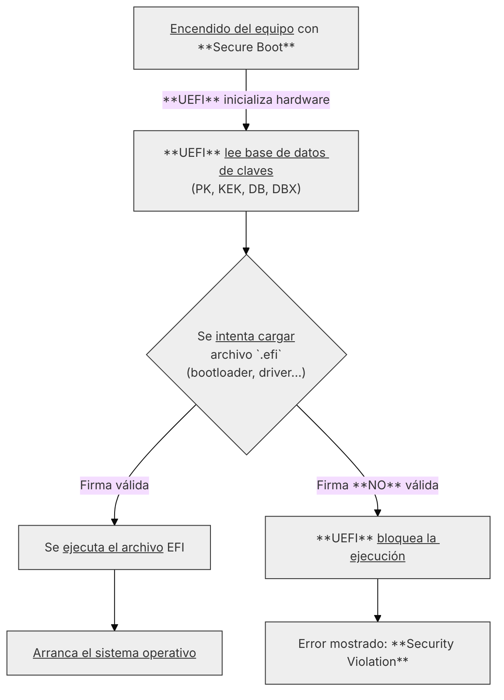
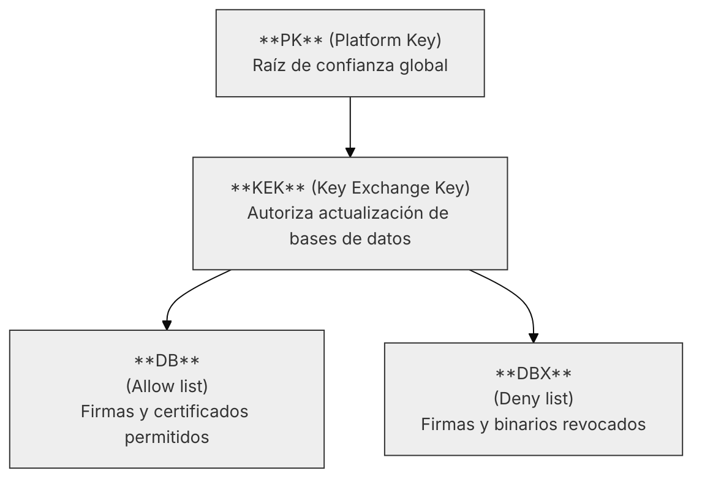
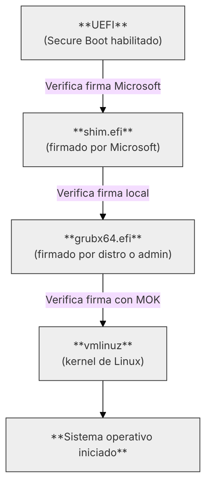

# Entendiendo UEFI

---

## 4. Seguridad en el Arranque (Secure Boot)

---

### 4.1. Introducción al Arranque Seguro (Secure Boot)

El **Arranque Seguro** (**Secure Boot**) es una característica fundamental de la especificación 
[UEFI](99-glosario.md#firmware-uefi) diseñada para proteger
el proceso de arranque del sistema contra software malicioso de bajo nivel como _rootkits_ y _bootkits_.

En esencia, **Secure Boot** asegura que el **firmware UEFI** solo cargue y ejecute 
[cargadores de arranque](99-glosario.md#bootloader-cargador-de-arranque) (`.efi`) y 
**controladores de dispositivos** que estén firmados digitalmente y autorizados por una clave de confianza previamente 
aprobada.

??? note
    En entornos empresariales, docentes o de laboratorio, mantener **Secure Boot habilitado** es muy recomendable como
    medida preventiva.

#### 4.1.1 Propósito y Cadena de Confianza

El propósito principal de **Secure Boot** es establecer una **cadena de confianza ininterrumpida** (**Chain of Trust**)
desde que se enciende el _hardware_ y este comienza a ejecutar el **firmware UEFI**, hasta que comienza a ejecutarse el
_kernel_ del sistema operativo.

Si cualquier componente durante el proceso de arranque (el cargador de Windows, el gestor GRUB, un driver del teclado, 
etc.) no tiene una firma digital válida, el firmware **rechaza su ejecución** y detiene el proceso de arranque.

Esto previene que código malicioso se inyecte en las primeras etapas del arranque, donde sería invisible para 
el _software antivirus tradicional._

#### 4.1.2 Funcionamiento General

El proceso de **Secure Boot** se basa en la **validación criptográfica** mediante _firmas digitales asimétricas_ (clave
pública/privada) y funciona de la siguiente manera:

1. **Validación de la Firma**: El **firmware UEFI** mantiene una base de datos de **claves públicas** de confianza.
2. **Verificación del archivo**: Cuando se intenta cargar un archivo `.efi`, o un **driver**, el firmware verifica 
si su firma digital fue creada con la **clave privada** correspondiente a una de las **claves públicas** en su base de datos.
3. **Ejecución o Rechazo**: 
    - Si la **firma es válida** y coincide con una clave de confianza, el firmware permite la ejecución del archivo.
    - Si la **firma no es válida**, no está presente o está en la lista negra, el firmware bloquea la ejecución y 
    puede mostrar un mensaje de error.

<div style="text-align: center">


</div>

---

### 4.2. Cadena de confianza y verificación de firmas digitales

La **Cadena de Confianza** (Chain of Trust) es el mecanismo jerárquico que utiliza **Secure Boot** para validar de 
forma progresiva cada componente que se carga durante el inicio del sistema. Si un solo eslabón de esta cadena 
falla la verificación, todo el proceso se detiene.

Cada eslabón de esta cadena valida la integridad y autenticidad del siguiente, garantizando que **solo se 
ejecuta código firmado por una entidad de confianza** desde el inicio del arranque hasta que el sistema operativo 
toma el control.

#### 4.2.1 Estructura de las Bases de Datos (NVRAM)

La _cadena de confianza_ en **Secure Boot** se construye mediante **cuatro tipos de bases de datos** dentro del 
**firmware UEFI**, almacenadas en la **NVRAM**, que 
definen los niveles de confianza:

| Base de datos | Nombre completo   | Propósito principal                                                                                                                                                         |
| ------------- | ----------------- | --------------------------------------------------------------------------------------------------------------------------------------------------------------------------- |
| **PK**        | Platform Key      | Representa la **autoridad raíz de confianza**. Controla quién puede modificar las demás bases de datos. Normalmente pertenece al fabricante o al administrador del sistema. |
| **KEK**       | Key Exchange Key  | Contiene claves autorizadas para **actualizar las bases de datos** de firmas y revocaciones (_DB_ y _DBX_).                                                                     |
| **DB**        | Allow Database    | Almacena **firmas y certificados válidos** de cargadores y controladores permitidos.                                                                                        |
| **DBX**       | Disallow Database | Almacena **firmas revocadas o archivos bloqueados** por motivos de seguridad (por ejemplo, vulnerabilidades conocidas).                                                     |

#### 4.2.2 El Proceso de Verificación Paso a Paso

1. **Arranque del Firmware (Raíz de la Confianza)**: El firmware UEFI constituye el primer eslabón de la cadena de
confianza. Contiene las claves más importantes (la **PK** y la **KEK**) en su 
[NVRAM](99-glosario.md#nvram-non-volatile-random-access-memory), que son inmutables o solo se pueden cambiar
bajo condiciones muy controladas.
2. **Validación del Gestor de Arranque**: Cuando el **firmware UEFI** intenta cargar el **cargador de arranque**
(p. ej., `bootmgfw.efi` de Windows o `shim.efi` de Linux), utiliza la base de datos **DB** 
(_Database of Allowed Signatures_) para verificar la **firma digital** del archivo.
3. **Validación de Controladores (Drivers)**: Una vez cargado el **gestor de arranque**, este puede necesitar cargar 
controladores u otros módulos adicionales. Antes de ejecutarlos, verifica sus firmas contra las mismas bases de 
datos de confianza (**DB**).
4. **Validación del Kernel**: Finalmente, el **kernel del sistema operativo** 
(o, en el caso de Linux, del gestor de arranque final como GRUB) también se valida mediante la **DB**. Si la firma es
válida, se permite la ejecución y la carga del sistema operativo.

#### 4.2.3 Claves y Certificados

Las claves empleadas en _Secure Boot_ se basan en **criptografía asimétrica**, que utiliza un par de claves 
complementarias:

- **Clave privada**, utilizada por el firmante (fabricante, administrador, distribuidor de sistema operativo)
para generar la firma.
- **Clave pública**, almacenada en el firmware, que permite validar la autenticidad de la firma
sin exponer la clave privada.

Cada firma digital se acompaña de un **certificado X.509**, que identifica a la entidad emisora y permite verificar
su validez jerárquica y temporal.

#### 4.2.4 Importancia de la Firma Digital

En el contexto de _Secure Boot_, una **firma digital** cumple un doble propósito:

- **Autenticidad**: Asegura que el software fue creado por una fuente de confianza 
(Microsoft, Canonical, un fabricante de hardware, etc.).
- **Integridad**: Garantiza que el software no ha sido alterado o manipulado desde que fue 
firmado digitalmente por su creador.

Si un atacante intenta inyectar código malicioso en el gestor de arranque, su acción invalidaría la firma digital 
original. El **firmware UEFI** detectaría la manipulación y rechazaría el arranque mostrando un error de 
"**Security Violation**".

---

### 4.3. Gestión de claves: PK, KEK, DB y DBX

En esta sección veremos que se pueden manipular estas bases de datos de claves para poner las que interesen. Es 
interesante a nivel pedagógico para entender cómo funciona Secure Boot, pero en la práctica no es recomendable 
hacerlo pues se pierde la posibilidad de arrancar sistemas operativos firmados por los fabricantes como Windows.

El mecanismo de **Secure Boot** se basa en un sistema jerárquico de **claves criptográficas** y **bases de datos de 
confianza** que determinan qué software puede o no ejecutarse durante el arranque.

Estas claves se almacenan en la **NVRAM** del **firmware UEFI** y se gestionan bajo una estructura de 
**autoridad delegada**, donde cada nivel controla el siguiente.

#### 4.3.1 Jerarquía de Confianza

La relación entre las claves puede visualizarse como una pirámide de autoridad:

<div style="text-align: center">


</div>

Cada base de datos cumple un propósito distinto, pero todas cooperan para **mantener una cadena de confianza 
segura y actualizable**.

#### 4.3.2 La Platform Key (PK)

La **Platform Key** (**_PK_**) es la **clave raíz de confianza** del sistema.
Determina quién tiene autoridad para modificar las demás bases de datos y, por tanto, 
**controla la configuración global de Secure Boot**.

- Solo puede existir **una PK activa**.
- Su propietario (fabricante o administrador) es el **único autorizado** para sustituirla o eliminarla.
- Cuando se instala una **nueva PK**, el **firmware entra en modo de configuración** y requiere validación física
(por ejemplo, confirmación desde la interfaz UEFI).

En entornos empresariales o docentes, es posible reemplazar la PK del fabricante por una **PK propia**,
lo que otorga **control total del entorno de arranque** (pero se sacrifican arranques como Windows que ya vienen
firmados y no le podemos añadir la firma con la PK propia).

#### 4.3.3 La Key Exchange Key (KEK)

La **KEK** (**Key Exchange Key**) actúa como un intermediario autorizado entre la **PK** y las 
bases de datos de firmas (**DB** y **DBX**).

- Permite actualizar o revocar entradas en las bases de datos sin necesidad de acceder directamente a la **PK**.
- Puede haber **varias KEK válidas** (por ejemplo, una de Microsoft y otra del administrador local).
- Cada actualización debe estar firmada con una **KEK válida** para ser aceptada por el firmware.

Esto garantiza que las actualizaciones de seguridad (como revocar una firma comprometida) puedan aplicarse 
de forma segura sin exponer la clave principal.

#### 4.3.4 Bases de Datos DB y DBX

Las dos bases de datos operativas del sistema son:

- **DB** (_Database of Allowed Signatures_):
Contiene los certificados y hashes de binarios EFI que pueden ejecutarse.
Incluye normalmente las firmas de _Microsoft_, _Canonical_ o _Red Hat_, así como las del _administrador local_.
- **DBX** (_Database of Disallowed Signatures_):
Lista de firmas **revocadas** o **bloqueadas por vulnerabilidades** conocidas o compromisos de seguridad.
Las actualizaciones de **DBX** son publicadas periódicamente por los fabricantes o los distribuidores
del sistema operativo.

Cuando un archivo `.efi` se ejecuta, el firmware compara su firma con ambas bases de datos:

- Si aparece en **DB**, se autoriza la ejecución.
- Si aparece en **DBX**, se bloquea inmediatamente.

#### 4.3.5 Modos de Operación: Setup Mode y User Mode

El **firmware UEFI** puede operar en dos modos distintos relacionados con Secure Boot:

| Modo           | Descripción                                                               | Uso típico                                                                                 |
|----------------|---------------------------------------------------------------------------|--------------------------------------------------------------------------------------------|
| **Setup Mode** | No hay **PK** cargada. Permite instalar nuevas claves (PK, KEK, DB, DBX). | Fábricas, administración o configuración inicial.                                          |
| **User Mode**  | Secure Boot está activo y las claves están instaladas.                    | Operación normal del sistema. No se pueden modificar claves sin autorización de la **PK**. |


Un sistema recién salido de fábrica suele iniciarse en Setup Mode, tras lo cual el fabricante instala su **PK** y **activa
User Mode**, bloqueando los cambios posteriores.

#### 4.3.6 Sustitución o Personalización de Claves

En entornos avanzados (laboratorios, investigación o seguridad reforzada), los administradores pueden optar por 
gestionar sus propias claves:

1. Desactivar temporalmente Secure Boot o cambiar a Setup Mode.
2. Generar un nuevo conjunto de claves (PK, KEK, DB y DBX).
3. Firmar sus propios binarios EFI o gestores de arranque.
4. Activar nuevamente Secure Boot con las nuevas claves.

Esto permite implementar un entorno de arranque completamente personalizado, garantizando que solo software 
firmado por el administrador pueda ejecutarse.

Técnicamente, el proceso sería algo parecido a esto (aunque no se entra en demasiado detalle ni pruebas prácticas
debido a que al generar nuestras propias claves se pierde la posibilidad de arrancar Windows u otros sistemas firmados):

Las herramientas básicas utilizadas aquí son [**OpenSSL**](https://www.openssl.org/) y
[**efitools**](https://github.com/vathpela/efitools)

```bash
# Crear directorio de trabajo
mkdir ~/uefi-keys && cd ~/uefi-keys

# Crear la PK (Platform Key)
openssl req -new -x509 -newkey rsa:2048 -subj "/CN=MiPK/" \
  -keyout PK.key -out PK.crt -days 3650 -sha256 -nodes

# Crear la KEK
openssl req -new -x509 -newkey rsa:2048 -subj "/CN=MiKEK/" \
  -keyout KEK.key -out KEK.crt -days 3650 -sha256 -nodes

# Crear la DB (base de datos de binarios válidos)
openssl req -new -x509 -newkey rsa:2048 -subj "/CN=MiDB/" \
  -keyout DB.key -out DB.crt -days 3650 -sha256 -nodes
```

Una vez tenemos los certificados generados, se convierten a formato EFI:

```bash
cert-to-efi-sig-list -g "$(uuidgen)" PK.crt PK.esl
cert-to-efi-sig-list -g "$(uuidgen)" KEK.crt KEK.esl
cert-to-efi-sig-list -g "$(uuidgen)" DB.crt DB.esl

sign-efi-sig-list -k PK.key -c PK.crt PK PK.esl PK.auth
sign-efi-sig-list -k PK.key -c PK.crt KEK KEK.esl KEK.auth
sign-efi-sig-list -k KEK.key -c KEK.crt DB DB.esl DB.auth
```

Y se importan las claves al firmware UEFI (esto puede variar según el fabricante y se hace normalmente desde la 
interfaz UEFI). Una vez se entre en el modo _Custom Secure Boot_, se importan las claves:

- Cargar `PK.auth` → establece tu PK.
- Cargar `KEK.auth` → autoriza tu KEK.
- Cargar `DB.auth` → define tu base de binarios permitidos.

??? warning "Pierdes la **confianza** en firmas de terceros"
    Al sustituir las claves por unas propias, **pierdes la capacidad de arrancar sistemas operativos firmados por
    terceros** (como Windows o distribuciones Linux que usan _shim_ firmado por Microsoft). Solo podrás arrancar
    software firmado con tus propias claves. Generalmente, se puede firmar _shim_ con tus nuevas claves para permitir el 
    arranque de Linux, pero Windows dejará de funcionar.

???+ note "Caso práctico más razonable: Añadir claves adicionales"
    En lugar de sustituir las claves originales, una práctica más común y segura es **añadir claves adicionales** a 
    las bases de datos existentes (**DB**). Esto permite mantener la capacidad de arrancar sistemas firmados por terceros, 
    mientras se otorga confianza a software personalizado.

---

### 4.4 El componente shim en Linux y el MOK (Machine Owner Key)

El mecanismo de **Secure Boot**, definido por el **estándar UEFI**, fue adoptado y promovido por los principales
fabricantes de hardware y **Microsot**, que mantiene una de las **autoridades de certificación** (CA) más utilizadas
para firmar los binarios de arranque. Esto plantea un problema para los sistemas **GNU/Linux**, cuyos cargadores 
de arranque y núcleos no están firmados directamente por **Microsoft**.

Para solventar esta limitación, las principales distribuciones de GNU/Linux (Ubuntu, Fedora, openSUSE, Debian, etc.) 
utilizan un componente intermedio llamado **_shim_**, que actúa como un “**traductor de confianza**” entre el 
**firmware UEFI** y el gestor de arranque **GRUB2**.

#### 4.4.1 El Rol de Shim (Pre-cargador)

El Shim (`shim.efi`) es un pequeño **cargador de arranque** cuya única función es actuar como el **primer binario de
confianza** en el entorno **GNU/Linux**. Está firmado por **Microsoft** y sirve para validar y cargar GRUB2 (u otro
[bootloader](99-glosario.md#bootloader-cargador-de-arranque)) que esté firmado con una clave local de la distribución.

Su papel es esencial pues permite que un sistema **GNU/Linux** arranque sin problema **manteniendo el Secure Boot
activado** sin requerir que el **firmware UEFI** confíe directamente en las claves del desarrollador o del usuario.

En resumen:

1. _Canonical_, _Red Hat_ y otras distribuciones envían su binario `shim.efi` a **Microsoft** para que sea **firmado**
con su certificado.
2. Cuando el _firmware_ ejecuta el cargador, el `shim.efi` es validado sin problema contra su **DB** pues está firmado
por **Microsoft**.
3. **Shim** busca el siguiente binario a cargar y le pasa el control (generalmente a _GRUB2_). En lugar de las claves
que hemos visto en el _firmware_ (_PK_, _KEK_, _DB_ y _DBX_) **Shim** utiliza sus propias claves incrustadas o las
claves del **MOK** para verificar el binario de _GRUB_.

Así, la **cadena de confianza** se extiende: el _firmware_ confía en Microsoft, que a su vez 
**valida el shim**, y este, mediante **sus propias claves** (si viene de la propia distribución) o las del usuario 
(**MOK**), confía en el cargador de arranque del sistema GNU/Linux.

<div style="text-align: center">


</div>

#### 4.4.2 El MOK (Machine Owner Key)

Cuando un usuario recompila el _kernel_ o un _módulo de driver_ (no lo está haciendo la propia distribución), ese
binario **no** está firmado. Si **Secure Boot** está activo, el sistema no podrá arrancar.

El **MOK** es un mecanismo que permite al _usuario_ o al _administrador del sistema_ **añadir sus propias claves
públicas** a un almacén gestionado por el _propio Shim_. Así, en el caso del párrafo anterior, podrá firmar
y solventar el arranque de su sistema personalizado.

**MOK** se gestiona con la herramienta `mokutil`, y las claves se almacenan en la base de datos `MokList` (similar,
pero completamente independiente de **DB** y **DBX**).

Un ejemplo básico de uso:

```bash
# Crear una nueva clave MOK (par pública/privada)
openssl req -new -x509 -newkey rsa:2048 -keyout MOK.key -out MOK.crt \
  -subj "/CN=MiClaveMOK/" -days 3650 -nodes -sha256

# Firmar un módulo de kernel usando la clave MOK recién creada
sudo /usr/src/linux-headers-$(uname -r)/scripts/sign-file sha256 MOK.key MOK.crt /path/to/mimodulo.ko

# Registrar la clave en el sistema
sudo mokutil --import MOK.crt
```

En el siguiente arranque, tras importar una nueva clave, el sistema pedirá una confirmación y abrirá el **Mok 
Manager**, que permite añadir la nueva clave definitivamente.

